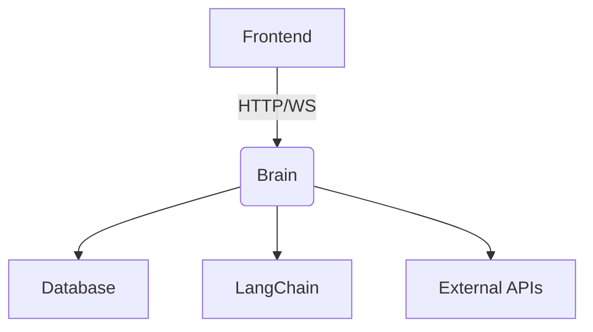

# Архитектура Jarilo Ecosystem

## Основные компоненты

### 1. Ядро системы (Brain)
- **Назначение**: Центральный координатор workflow
- **Технологии**: FastAPI, LangChain, SQLAlchemy
- **Особенности**:
  - Асинхронная обработка задач
  - Интеграция с языковыми моделями
  - Управление состоянием системы

### 2. Модуль оркестрации
- **Workflow Engine**: LangGraph
- **Типы нод**:
  - Input/Output
  - Process
  - Conditional
  - LLM Integration

### 3. API Gateway
- **REST API**: FastAPI эндпоинты
- **WebSocket**: Реалтайм обновления
- **Аутентификация**: OAuth2 + API Keys

## Диаграмма взаимодействия

## Принципы проектирования
1. **Модульность**: Каждый компонент независим
2. **Масштабируемость**: Горизонтальное масштабирование
3. **Отказоустойчивость**: Retry механизмы
4. **Безопасность**: Шифрование sensitive данных